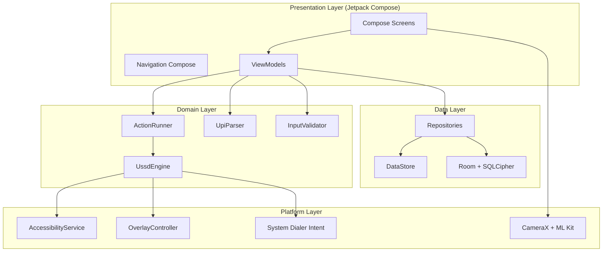
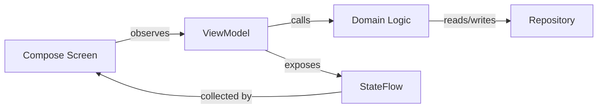
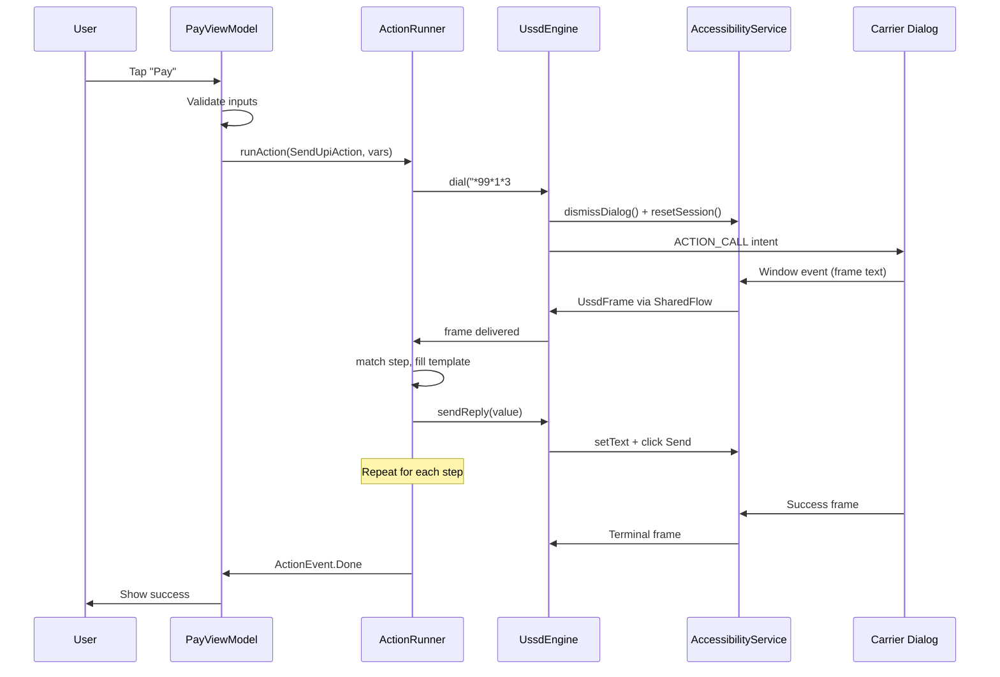
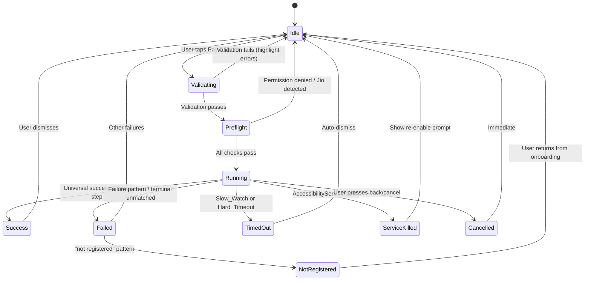

# Design Document: OffPay Native Android App

## Overview

OffPay is a pure-native Kotlin Android application that enables fully offline UPI payments via India's *99# USSD infrastructure. The app automates multi-step carrier USSD dialogs using an AccessibilityService, presents a polished dark-themed UI via Jetpack Compose, and supports three operation modes (Dialer, Advanced, Overlay) for varying levels of automation.

The system combines:
- **CameraX + ML Kit** for real-time QR code scanning
- **AccessibilityService** for reading/driving the system USSD dialog
- **TYPE_APPLICATION_OVERLAY** window for covering the carrier dialog with branded UI
- **Room + SQLCipher** for encrypted transaction history
- **Coroutines + Flow** for reactive USSD event streaming
- **DataStore** for persisted preferences

All operations are fully offline — no network requests are made after installation.

## Architecture

### High-Level Architecture



### Single-Activity Architecture

The app uses a single `MainActivity` with Navigation Compose managing all screen transitions. This avoids activity-racing with the USSD dialog window (a known issue from the test app).

### MVVM Pattern



### USSD Session Data Flow



## Components and Interfaces

### 1. UssdAccessibilityService

Ported directly from the test app's Kotlin implementation. Watches USSD dialog packages, captures frames, and drives replies.

```kotlin
class UssdAccessibilityService : AccessibilityService() {
    companion object {
        @Volatile var instance: UssdAccessibilityService? = null
        
        val USSD_PACKAGES = setOf(
            "com.android.phone",
            "com.android.server.telecom",
            "com.samsung.android.app.telephonyui",
            "com.google.android.dialer",
            "com.android.dialer"
        )
    }

    // State
    private var lastEmittedText: String? = null

    // Public API (called from UssdEngine)
    fun sendReply(reply: String): Boolean
    fun dismissDialog(): Boolean
    fun resetForNewSession()

    // Internal
    private fun handleDialog(root: AccessibilityNodeInfo)
    private fun findUssdRoot(): AccessibilityNodeInfo?
    private fun collectTexts(node: AccessibilityNodeInfo): List<String>
    private fun hasInput(node: AccessibilityNodeInfo): Boolean
    private fun hasOnlyDismiss(node: AccessibilityNodeInfo): Boolean
    private fun isSystemPlaceholder(text: String): Boolean
}
```

### 2. UssdEngine

Central coordinator between the AccessibilityService and the ActionRunner. Manages session lifecycle, frame emission, and overlay coordination.

```kotlin
class UssdEngine(
    private val context: Context,
    private val overlayController: OverlayController
) {
    // Session state
    private var sessionId: Int = 0
    private var sessionActive: Boolean = false

    // Reactive frame stream
    private val _frames = MutableSharedFlow<UssdFrame>(extraBufferCapacity = 16)
    val frames: SharedFlow<UssdFrame> = _frames

    // Public API
    suspend fun dial(code: String)
    suspend fun sendReply(reply: String): Boolean
    suspend fun cancel()
    suspend fun dismissDialog(): Boolean
    fun getSessionId(): Int
    fun isServiceEnabled(): Boolean

    // Called by AccessibilityService
    fun onFrame(text: String, isMenu: Boolean, isTerminal: Boolean)
    fun onSessionEnd(reason: String)

    // Internal
    private fun incrementSessionId(): Int
    private fun resetForNewSession()
}
```

### 3. ActionRunner

Executes scripted USSD action flows. Pure domain logic with no Android framework dependencies (testable in isolation).

```kotlin
class ActionRunner(private val engine: UssdEngine) {

    fun runAction(
        action: Action,
        vars: Map<String, String>,
        scope: CoroutineScope
    ): ActionRun

    // Internal
    private fun matchStep(frame: UssdFrame, steps: List<ActionStep>, fromIndex: Int): Int
    private fun fillTemplate(template: String, vars: Map<String, String>): String
    private fun matchesUniversalSuccess(text: String): Boolean
    private fun matchesFailurePattern(text: String, patterns: List<Regex>): Boolean
}

data class ActionRun(
    val events: SharedFlow<ActionEvent>,
    val cancel: suspend () -> Unit,
    val result: Deferred<ActionResult>
)
```

### 4. OverlayController

Manages the TYPE_APPLICATION_OVERLAY window. Ported from the test app's `UssdOverlayController.kt`.

```kotlin
class OverlayController(private val context: Context) {
    fun canShow(): Boolean
    fun show(title: String, subtitle: String, stepLabel: String)
    fun update(title: String, subtitle: String, stepLabel: String)
    fun showError(title: String, message: String, holdMs: Long = 1200L)
    fun hide()
    
    var onCancel: (() -> Unit)?
}
```

### 5. QrScannerManager

CameraX + ML Kit integration for QR code scanning.

```kotlin
class QrScannerManager {
    fun bindToLifecycle(
        lifecycleOwner: LifecycleOwner,
        previewView: PreviewView,
        onResult: (String) -> Unit
    )
    fun setZoomRatio(ratio: Float)  // 1.0x to 3.0x
    fun unbind()
    
    // Gallery import
    suspend fun decodeFromUri(context: Context, uri: Uri): String?
}
```

### 6. UpiParser

Parses `upi://pay?` URIs and validates VPA format. Pure function, no dependencies.

```kotlin
object UpiParser {
    fun parse(raw: String): UpiData?
    fun isValidVpa(vpa: String): Boolean
    fun extractVpaFromText(text: String): String?
}

data class UpiData(
    val vpa: String,
    val payeeName: String?,
    val amount: String?,
    val transactionNote: String?
)
```

### 7. InputValidator

Validates payment form inputs before session initiation.

```kotlin
object InputValidator {
    fun validateVpa(vpa: String): ValidationResult
    fun validateAmount(amount: String): ValidationResult
    fun validatePin(pin: String): ValidationResult
    fun validatePaymentForm(vpa: String, amount: String, pin: String): FormValidationResult
}

data class ValidationResult(val isValid: Boolean, val errorMessage: String?)
data class FormValidationResult(val errors: Map<FormField, String>)
enum class FormField { VPA, AMOUNT, PIN }
```

### 8. ViewModels

```kotlin
class PayViewModel(
    private val actionRunner: ActionRunner,
    private val historyRepo: HistoryRepository,
    private val prefsRepo: PreferencesRepository,
    private val carrierDetector: CarrierDetector
) : ViewModel() {
    val uiState: StateFlow<PayUiState>
    val sessionState: StateFlow<SessionState>

    fun onQrScanned(raw: String)
    fun startPayment(vpa: String, amount: String, note: String, pin: String)
    fun cancelSession()
    fun clearFieldError(field: FormField)
}

class BalanceViewModel(
    private val actionRunner: ActionRunner,
    private val prefsRepo: PreferencesRepository
) : ViewModel() {
    val uiState: StateFlow<BalanceUiState>
    fun checkBalance(pin: String)
    fun cancelSession()
}

class HistoryViewModel(
    private val historyRepo: HistoryRepository
) : ViewModel() {
    val transactions: StateFlow<List<TransactionRecord>>
    fun clearHistory()
}
```

### 9. CarrierDetector

Detects SIM carrier and applies fail-fast rules.

```kotlin
class CarrierDetector(private val context: Context) {
    suspend fun getActiveSimInfo(): SimInfo?
    fun isUnsupportedCarrier(carrierName: String): Boolean
    fun isNotRegisteredError(text: String): Boolean

    companion object {
        val JIO_PATTERN = Regex("jio|reliance", RegexOption.IGNORE_CASE)
        val NOT_REGISTERED_PATTERNS = listOf(
            Regex("could\\s+not\\s+find\\s+(your|ur)\\s+bank", RegexOption.IGNORE_CASE),
            Regex("is\\s+not\\s+a\\s+valid\\s+selection", RegexOption.IGNORE_CASE),
            Regex("please\\s+enter\\s+the\\s+correct\\s+no", RegexOption.IGNORE_CASE),
            Regex("bank\\s+not\\s+found|no\\s+bank\\s+(linked|found)", RegexOption.IGNORE_CASE)
        )
    }
}
```

### 10. Navigation & Screens

```kotlin
sealed class Screen(val route: String) {
    object Home : Screen("home")
    object Pay : Screen("pay")
    object Balance : Screen("balance")
    object QrScanner : Screen("qr_scanner")
    object History : Screen("history")
    object Faq : Screen("faq")
    object About : Screen("about")
    object NotRegistered : Screen("not_registered")
    object Settings : Screen("settings")  // mode toggle lives here
}
```

## Data Models

### Core Domain Models

```kotlin
// USSD Frame — captured from carrier dialog
data class UssdFrame(
    val text: String,
    val isMenu: Boolean,
    val isTerminal: Boolean,
    val sessionId: Int,
    val frameId: Int,
    val timestamp: Long = System.currentTimeMillis()
)

// Action definition — scripted USSD flow
data class Action(
    val code: String,
    val steps: List<ActionStep>,
    val failurePatterns: List<Regex> = emptyList(),
    val timeoutMs: Long = 25_000L
)

data class ActionStep(
    val match: Regex,
    val reply: String? = null,
    val done: Boolean = false,
    val label: String? = null,
    val delayMs: Long = 250L
)

// Action execution events
sealed class ActionEvent {
    data class Progress(val stepIndex: Int, val total: Int, val label: String?) : ActionEvent()
    data class Frame(val frame: UssdFrame, val stepIndex: Int) : ActionEvent()
    data class Reply(val value: String, val stepIndex: Int) : ActionEvent()
    data class Done(val resultText: String) : ActionEvent()
    data class Error(val message: String, val resultText: String) : ActionEvent()
}

data class ActionResult(val success: Boolean, val resultText: String)

// Operation modes
enum class OperationMode { DIALER, ADVANCED, OVERLAY }

// Session state for UI
sealed class SessionState {
    object Idle : SessionState()
    data class Running(val label: String, val stepIndex: Int, val total: Int) : SessionState()
    data class Success(val resultText: String) : SessionState()
    data class Failed(val message: String, val resultText: String) : SessionState()
}
```

### Persistence Models (Room)

```kotlin
@Entity(tableName = "transactions")
data class TransactionEntity(
    @PrimaryKey(autoGenerate = true) val id: Long = 0,
    @ColumnInfo(name = "vpa") val vpa: String,
    @ColumnInfo(name = "payee_name") val payeeName: String?,
    @ColumnInfo(name = "amount") val amount: String,
    @ColumnInfo(name = "note") val note: String?,
    @ColumnInfo(name = "carrier_reply") val carrierReply: String,
    @ColumnInfo(name = "timestamp") val timestamp: Long
)

@Dao
interface TransactionDao {
    @Query("SELECT * FROM transactions ORDER BY timestamp DESC LIMIT 200")
    fun getAll(): Flow<List<TransactionEntity>>

    @Insert
    suspend fun insert(transaction: TransactionEntity)

    @Query("DELETE FROM transactions WHERE id NOT IN (SELECT id FROM transactions ORDER BY timestamp DESC LIMIT 200)")
    suspend fun trimOldest()

    @Query("DELETE FROM transactions")
    suspend fun deleteAll()

    @Query("SELECT COUNT(*) FROM transactions")
    suspend fun count(): Int
}
```

### DataStore Preferences

```kotlin
object PreferencesKeys {
    val OPERATION_MODE = stringPreferencesKey("operation_mode")
    val BATTERY_WARNING_DISMISSED = booleanPreferencesKey("battery_warning_dismissed")
    val FIRST_LAUNCH_COMPLETE = booleanPreferencesKey("first_launch_complete")
}
```

### Pre-Built Actions

```kotlin
object Actions {
    val SendUpi = Action(
        code = "*99*1*3#",
        steps = listOf(
            ActionStep(
                match = Regex("(receiver|payee|recipient|vpa|virtual.*payment|upi.*id)", RegexOption.IGNORE_CASE),
                reply = "{vpa}",
                label = "Sending UPI ID"
            ),
            ActionStep(
                match = Regex("\\bamount\\b", RegexOption.IGNORE_CASE),
                reply = "{amount}",
                label = "Sending amount"
            ),
            ActionStep(
                match = Regex("\\b(remark|comment|note)\\b", RegexOption.IGNORE_CASE),
                reply = "{note}",
                label = "Adding note"
            ),
            ActionStep(
                match = Regex("\\bupi\\s*pin\\b|\\b(enter|6\\s*digit).*pin\\b", RegexOption.IGNORE_CASE),
                reply = "{pin}",
                label = "Entering UPI PIN"
            ),
            ActionStep(
                match = Regex("\\b(confirm|press\\s*1|are you sure)\\b", RegexOption.IGNORE_CASE),
                reply = "1",
                label = "Confirming"
            ),
            ActionStep(
                match = Regex("successful|payment\\s+(?:sent|completed|done)|thank\\s*you\\s*for\\s*using|reference\\s+(?:no|number|id)\\s*[:\\-]", RegexOption.IGNORE_CASE),
                done = true,
                label = "Payment complete"
            )
        ),
        failurePatterns = COMMON_FAILURES,
        timeoutMs = 25_000L
    )

    val CheckBalance = Action(
        code = "*99*3#",
        steps = listOf(
            ActionStep(
                match = Regex("upi\\s*pin|enter.*pin|6\\s*digit.*pin", RegexOption.IGNORE_CASE),
                reply = "{pin}",
                label = "Entering UPI PIN"
            ),
            ActionStep(
                match = Regex("balance|avail(able)?|rs\\.?\\s*\\d|inr\\s*\\d|₹\\s*\\d|amount\\s*(is|:)|ledger|a/c\\s*bal", RegexOption.IGNORE_CASE),
                done = true,
                label = "Balance fetched"
            )
        ),
        failurePatterns = COMMON_FAILURES + listOf(
            Regex("pin\\s*(does\\s*not|doesn't)\\s*match", RegexOption.IGNORE_CASE),
            Regex("authentication\\s*failed", RegexOption.IGNORE_CASE)
        ),
        timeoutMs = 18_000L
    )
}
```

### SIM/Carrier Info

```kotlin
data class SimInfo(
    val slotIndex: Int,
    val subscriptionId: Int,
    val carrierName: String?,
    val countryIso: String?,
    val mcc: String?,
    val mnc: String?
)
```


## Correctness Properties

*A property is a characteristic or behavior that should hold true across all valid executions of a system — essentially, a formal statement about what the system should do. Properties serve as the bridge between human-readable specifications and machine-verifiable correctness guarantees.*

### Property 1: UPI URI Parsing Round-Trip

*For any* valid `upi://pay?` URI containing a VPA (pa), optional payee name (pn), optional amount (am), and optional transaction note (tn), parsing the URI should produce a UpiData object whose fields exactly match the parameters encoded in the URI.

**Validates: Requirements 1.2**

### Property 2: Invalid Input Rejection

*For any* string that does not contain a valid `upi://pay?` URI and does not contain a substring matching the VPA pattern `[a-zA-Z0-9.\-_]{3,}@[a-zA-Z0-9.\-_]{3,}`, the UpiParser.parse() function should return null.

**Validates: Requirements 1.4**

### Property 3: QR Autofill Completeness

*For any* UpiData object with non-null fields, invoking the autofill action should result in form state where every non-null field from UpiData is populated in the corresponding form field, and null fields remain empty.

**Validates: Requirements 1.6**

### Property 4: Action Step Matching Correctness

*For any* Action definition and any ordered sequence of carrier frame texts where each frame text matches the corresponding step's regex in order, the ActionRunner should progress through all steps sequentially, sending the correct templated reply for each matched step.

**Validates: Requirements 2.2, 3.2, 3.3**

### Property 5: Universal Success Detection

*For any* string matching at least one of the universal success patterns (contains "is successful", "successfully sent/paid/completed", "transaction successful", "payment successful", or a reference ID of 6+ digits), the matchesUniversalSuccess function should return true.

**Validates: Requirements 2.3**

### Property 6: Failure Pattern Detection

*For any* string matching at least one of the defined failure patterns (wrong PIN, invalid VPA, insufficient balance, service unavailable, sender-receiver same, PSP not registered), the matchesFailurePattern function should return true.

**Validates: Requirements 2.4, 3.4**

### Property 7: Unmatched Terminal Frame Causes Failure

*For any* terminal UssdFrame whose text does not match any step regex in the current action AND does not match any universal success pattern, the ActionRunner should terminate the session as a failure with the frame's text as the error message.

**Validates: Requirements 2.5, 6.4**

### Property 8: Operation Mode Persistence Round-Trip

*For any* OperationMode value (DIALER, ADVANCED, OVERLAY), persisting the mode to DataStore and then reading it back should yield the same OperationMode value.

**Validates: Requirements 4.5**

### Property 9: Session ID Monotonicity

*For any* sequence of N dial() calls (N ≥ 2), the sessionId produced by each successive call should be strictly greater than the previous sessionId.

**Validates: Requirements 5.1**

### Property 10: Stale Frame Filtering

*For any* active session with sessionId S, and any UssdFrame with a sessionId ≠ S, the frame should be discarded and not forwarded to the ActionRunner.

**Validates: Requirements 5.2**

### Property 11: Frame Deduplication and Filler Suppression

*For any* sequence of raw carrier frames, the emitted output sequence should contain no two consecutive frames with identical text AND should contain no frames whose text matches a system placeholder pattern (starts with "please wait", "processing", "loading", "connecting", "ussd code running").

**Validates: Requirements 6.2, 6.3**

### Property 12: Input Validation Composite Correctness

*For any* combination of (vpa, amount, pin) strings, the FormValidationResult should report errors for exactly those fields that fail their individual validation rules: VPA must match `[a-zA-Z0-9._-]+@[a-zA-Z0-9]+` with length ≤ 50; amount must be 0.01–5000 with ≤ 2 decimal places; PIN must be 4–6 digits only.

**Validates: Requirements 8.1, 8.2, 8.3, 8.4**

### Property 13: Error Highlight Clearing on Edit

*For any* FormValidationResult containing errors on multiple fields, editing a single field should clear the error highlight for only that field, leaving all other field errors unchanged.

**Validates: Requirements 8.5**

### Property 14: PIN Cleared After Session Completion

*For any* session termination event (success, failure, timeout, or user cancellation), the PIN value in the ViewModel state should be empty within 500ms of the event.

**Validates: Requirements 9.1**

### Property 15: PIN Masking Correctness

*For any* PIN string (4–6 digits) and any vars map containing that PIN value, the maskReply function should return "••••" when the reply value equals the PIN, and should never return a string containing the original PIN digits.

**Validates: Requirements 9.3**

### Property 16: PIN Regex No False Positives

*For any* string containing "PIN" only as a substring within other words (e.g., "SPINNING", "PINCODE", "OPINION") and NOT as a standalone word matching `\bPIN\b` or `\bupi\s*pin\b`, the PIN-prompt step regex should NOT match.

**Validates: Requirements 9.5**

### Property 17: Carrier Detection Correctness

*For any* carrier name string matching the pattern `/jio|reliance/i`, isUnsupportedCarrier should return true. *For any* carrier frame text matching any of the "not registered" patterns, isNotRegisteredError should return true.

**Validates: Requirements 10.3, 10.4**

### Property 18: Transaction Persistence Round-Trip

*For any* valid TransactionEntity (non-empty VPA, valid amount string, positive timestamp, non-empty carrier reply), inserting the record and then querying all records should return a list containing an entry with matching VPA, amount, timestamp, and carrier reply fields.

**Validates: Requirements 11.1**

### Property 19: Transaction History Cap Invariant

*For any* sequence of N transaction insertions (N > 200), the total count of stored records should never exceed 200, and the retained records should be the 200 most recent by timestamp.

**Validates: Requirements 11.2**

### Property 20: Transaction History Ordering

*For any* set of transaction records with distinct timestamps, querying the history should return records sorted in strictly descending order of timestamp.

**Validates: Requirements 11.3**

## Error Handling

### Error Categories

| Category | Source | Handling |
|----------|--------|----------|
| Carrier rejection | Failure patterns in USSD frame text | Display carrier's exact text, clear PIN |
| Slow carrier | 12s Slow_Watch timeout | Abort session, show "Carrier unresponsive" |
| Hard timeout | 25s (send) / 18s (balance) absolute cap | Abort session, show timeout message |
| Service killed | AccessibilityService disabled mid-session | Abort session, show re-enable prompt |
| Permission denied | Missing CALL_PHONE, CAMERA, etc. | Block action, show permission guide |
| Unsupported carrier | Jio / CDMA detected | Block dial, show explanation |
| Not registered | Carrier says bank not linked | Route to onboarding screen |
| Invalid input | Form validation failure | Highlight fields, prevent dial |
| Storage exhausted | Room insert fails | Show storage error, preserve existing data |

### Error Flow



### PIN Security on Error

Every error path (failure, timeout, cancel, service killed) clears the PIN from ViewModel state within 500ms. The PIN is never logged, persisted, or included in error messages.

### Retry Strategy

The app does NOT auto-retry failed sessions. Carrier USSD sessions are stateful and expensive (they bill against the subscriber's USSD limit on some plans). The user must explicitly re-initiate.

## Testing Strategy

### Property-Based Testing

**Library**: [Kotest](https://kotest.io/) with the Property Testing module (`io.kotest:kotest-property`)

**Configuration**: Minimum 100 iterations per property test.

**Tag format**: `Feature: offpay-native-app, Property {number}: {property_text}`

Property tests target the pure domain logic:
- `UpiParser.parse()` and `UpiParser.isValidVpa()` (Properties 1, 2)
- `InputValidator.validatePaymentForm()` (Property 12)
- `ActionRunner.matchStep()` and step progression logic (Property 4)
- `matchesUniversalSuccess()` / `matchesFailurePattern()` (Properties 5, 6, 7)
- `fillTemplate()` for template substitution
- `maskReply()` (Property 15)
- `CarrierDetector.isUnsupportedCarrier()` / `.isNotRegisteredError()` (Property 17)
- Frame deduplication and filler suppression logic (Property 11)
- `isSystemPlaceholder()` (Property 11)
- Session ID management (Properties 9, 10)
- Transaction DAO operations (Properties 18, 19, 20)

### Unit Tests (Example-Based)

- Permission state → UI response mapping
- QR scanner error states (camera denied, no QR found)
- Operation mode toggle with active session (disabled)
- Back button cancellation
- Double-tap cooldown (2s debounce)
- Overlay show/update/hide lifecycle
- PIN cleared on navigation away
- Empty history state display

### Integration Tests

- CameraX + ML Kit QR decoding with sample images
- Room database CRUD with SQLCipher encryption
- DataStore read/write round-trips
- AccessibilityService window traversal (instrumented test)
- ACTION_CALL intent formation
- Overlay WindowManager add/remove

### UI Tests (Compose)

- Dark theme renders correctly
- Screen transitions complete within 300ms
- Form field error highlights appear/clear
- Mode toggle state persistence
- History list rendering and clear action

### Manual Testing

- Real USSD session against live carriers (Airtel, Vi, BSNL)
- Overlay visibility and touch pass-through
- AccessibilityService survival under battery optimization
- Multi-SIM device carrier detection
