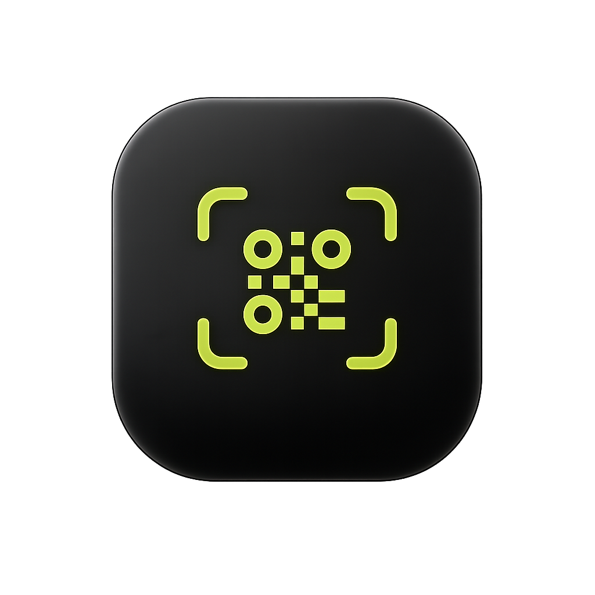
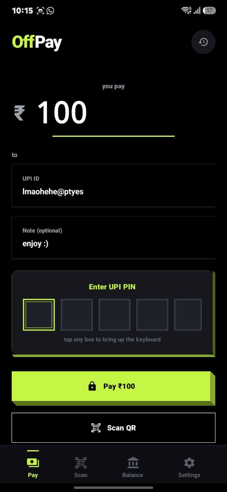
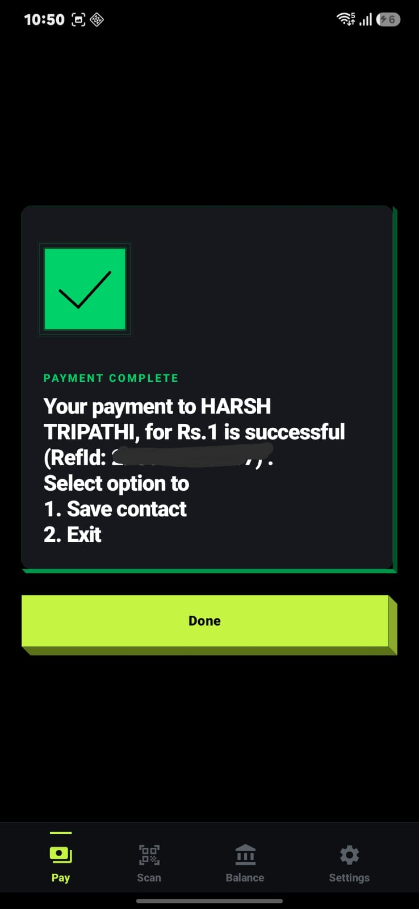
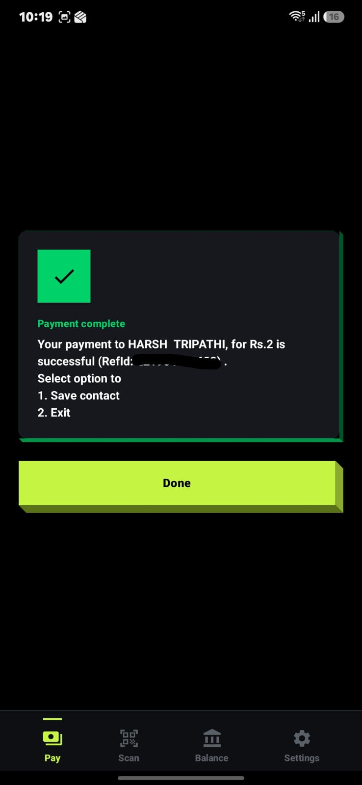
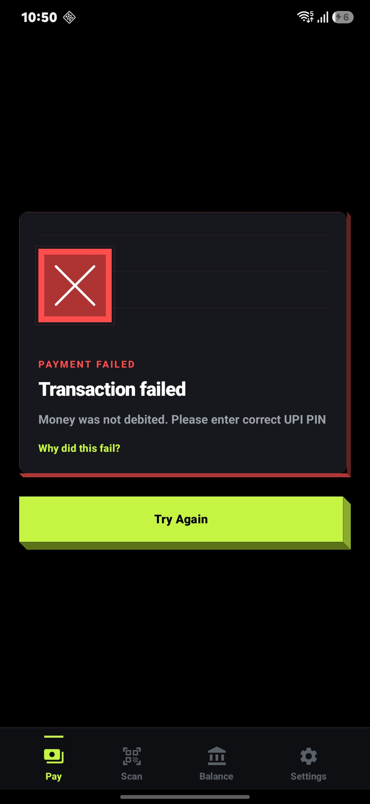
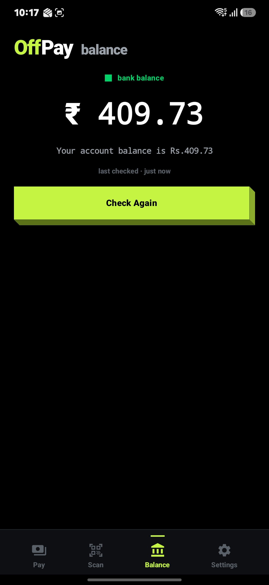
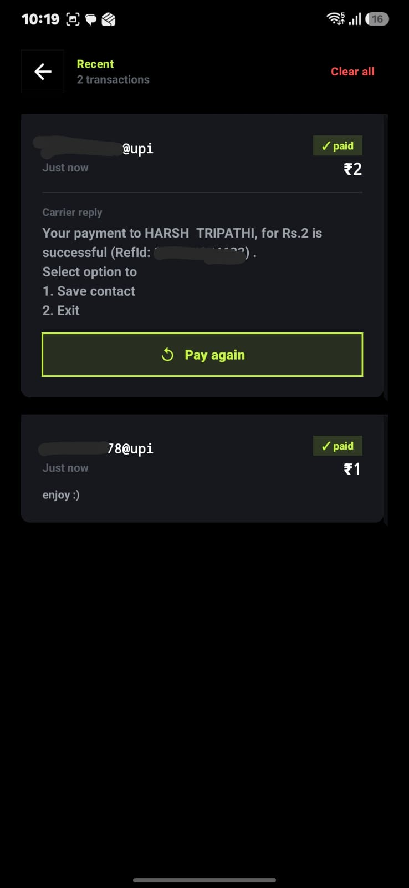
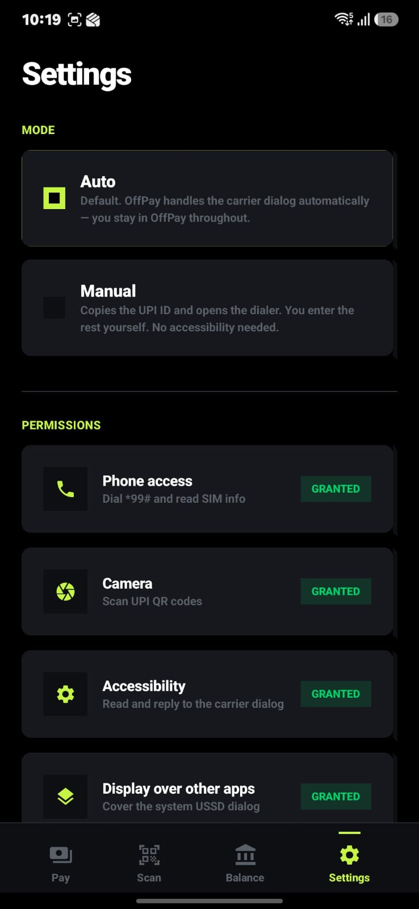

# OffPay

### UPI payments. Without the internet.

Send money. Check your balance. Scan QR codes. 
All over plain `*99#` USSD on your SIM. No data, no Wi-Fi, no account.

**[Website](https://offpayapp.vercel.app/)** · **[PWA](https://offpay.vercel.app/)** · **[Download APK](https://github.com/laksh-ya/offpayapp/releases)**

 

<table>
  <tr>
    <td align="center">
       
      <b>Type. Tap. Done.</b>
    </td>
    <td align="center">
       
      <b>Real bank confirmation. Fully offline.</b>
    </td>
  </tr>
</table>

---

## Why OffPay

Every other UPI app needs the internet. In huge parts of India, that's a luxury.

`*99#` is a USSD-based UPI service that works over your SIM's voice channel (no data needed). The catch: dialling raw codes and typing UPI IDs on a number pad is brutal. **OffPay puts a clean app on top of it.** Same modern feel as GPay or PhonePe: type, scan, tap. Zero bytes of data used.

> **Built by [Lakshya](https://github.com/laksh-ya) & [Harsh](https://github.com/harshtripathi272).** Side project, not a registered payment service. Your PIN, your data, your transactions: they never leave the device.

---

## What you get

🌐 **Fully offline** &nbsp;·&nbsp; no Wi-Fi, no mobile data: just a SIM with voice signal. 
💸 **Send money** &nbsp;·&nbsp; UPI ID, amount, optional note, your PIN. ₹1 to ₹5,000 per transaction. 
📷 **Scan or import QR** &nbsp;·&nbsp; live camera with pinch-to-zoom, or pick any QR image from gallery. 
🏦 **Check balance** &nbsp;·&nbsp; one tap, straight from the bank. 
🧾 **Encrypted history** &nbsp;·&nbsp; last 200 successful payments, on-device, encrypted. 
🚫 **Zero tracking** &nbsp;·&nbsp; no analytics, no ads, no servers, no account, zero outbound requests. 
🛡️ **PIN never persists** &nbsp;·&nbsp; held in memory only, wiped within 500 ms of every session. 
✨ **Polish** &nbsp;·&nbsp; custom success/failure animations, haptics on every tap.

---

## How it looks

| Pay | Success | Failed |
|:--:|:--:|:--:|
|  |  |  |
| Inline PIN, auto-fires on 6th digit | Animated check, real ref id | Carrier's exact error, never silent |

| Balance | History |
|:--:|:--:|
|  |  |
| Live from the bank, cached for later | Carrier reply + ref id + "Pay again" |

---

## Two modes, one toggle

<table>
<tr>
<td width="50%" valign="top">

### 🟢 Auto &nbsp;<i>(default)</i>

Branded OffPay screen covers the carrier dialog start to finish. You only ever see OffPay.

Needs accessibility + display-over-other-apps.

</td>
<td width="50%" valign="top">

### ⚪ Manual

OffPay copies the UPI ID, opens the system dialer with `*99*1*3#` prefilled. You drive the rest.

Works on any Android. No extra permissions.

</td>
</tr>
</table>

  

---

## Carrier reality check

| Carrier         | Status                                       |
|-----------------|----------------------------------------------|
| Airtel          |  works                                     |
| Vi (Vodafone Idea) |  works                                  |
| BSNL            |  works                                     |
| Jio             |  network doesn't support `*99#`. App refuses to dial. |

Bank not linked to `*99#`? Built-in onboarding guide walks you through enabling it once in BHIM.

---

## Privacy, in three lines

- Your **UPI PIN** lives only in process memory, wiped within 500 ms of every session ending.
- Your **transaction history** is in an encrypted SQLite database (SQLCipher) on your device. Uninstall = gone.
- The app makes **zero outbound network requests** after install. Verify with a network monitor.

Full Privacy Policy and Terms of Use are inside the app at **Settings → Legal**.

---

## Setup & Installation Guide

Setting up OffPay takes less than two minutes. Follow these steps to get started:

### Step 1: One-Time UPI Setup (Link your Bank Account)
OffPay automates the USSD channel. Your SIM card must be registered for `*99#` services with your bank first. If you have never used offline UPI before, perform this one-time link:
1. Open your phone's dialer application and dial `*99#`.
2. Enter your bank's name when prompted (e.g., SBI, HDFC, ICICI, PNB) or the first 4 letters of your bank branch's IFSC code.
3. Follow the on-screen menu prompts to link your bank account.
4. Set a UPI PIN (if you do not already have one set up for GPay, PhonePe, or BHIM).
*Once linked, you never need to repeat this step.*

### Step 2: Install the Android Application
1. Download the latest `OffPay.apk` from the [Releases](../../releases) tab.
2. Open the downloaded file on your Android device.
3. If prompted, allow your browser or file manager to "install apps from unknown sources".
4. Follow the installation prompts to finish installing the app.

### Step 3: Setup Permissions & Android 13+ Workaround
Upon first launch, OffPay will request permissions to run in **Auto mode** (which hides the raw carrier USSD dialogs and replaces them with a polished UI):
- **Phone (CALL_PHONE)**: Required to dial the USSD codes.
- **Accessibility Service**: Enables the app to read and fill out the carrier's text fields automatically.
- **Display over other apps (Overlay)**: Required to show the polished user interface over the system USSD dialog.

#### ⚠️ How to bypass "Restricted settings" warning on Android 13+
Because OffPay is sideloaded (not downloaded directly from Google Play Store), Android 13 and newer blocks Accessibility services for security by default. If you see the "Restricted setting" pop-up:
1. Go to your device **Settings** → **Apps** → **OffPay**.
2. Tap the **three vertical dots (⋮)** icon in the top-right corner.
3. Tap **Allow restricted settings** and confirm using your fingerprint/PIN.
4. Return to OffPay and enable the Accessibility service. It will now activate successfully.

*Note: If you do not want to grant Accessibility or Overlay permissions, you can skip them and run OffPay in **Manual mode**. The app will simply copy the recipient's VPA and dial the code for you, letting you respond to the carrier prompts manually.*

### Alternative: Web PWA (iOS & Tablets)
If you are on an iPhone, tablet, or do not wish to install an APK:
1. Open **[offpay.vercel.app](https://offpay.vercel.app/)** in your browser.
2. Tap the browser's "Share" or "Menu" icon and select **Add to Home Screen**.
3. Use the app to generate payment flows; it will copy details and open the system dialer with `*99*1*3#` prefilled for a Manual-mode session.

---

## Design

OffPay's look is inspired by [CRED's NeoPOP design language](https://cred.club/neopop): sharp surfaces, lime-on-black, geometric depth. Every animation is custom-built to feel native to that vocabulary, not a stock Lottie.

---

## Coming soon

- More languages (Hindi, Tamil, Telugu, Bengali, Marathi to start)
- Real video walkthroughs in onboarding
- Per-bank quirk handling for the long tail of `*99#` flavours

---

## Contribute

PRs welcome. See [CONTRIBUTING.md](CONTRIBUTING.md) to get started, [ARCHITECTURE.md](ARCHITECTURE.md) if you want to dig into the internals.

---

## License

[MIT](LICENSE) · Built with care by Lakshya & Harsh.
